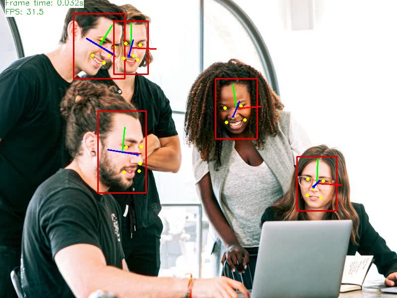

# 顔検出＆関連検出処理サンプル

## ファイル構成

| ファイル             | 内容                                             |
|----------------------|--------------------------------------------------|
| demo.sh              | スクリプト実行コマンド                           |
| _model_download.sh   | モデルファイルをダウンロードするスクリプト       |
|                      |                                                  |
| face.py              | 顔検出＆関連検出スクリプト本体                   |
| visualizer.py        | 画像関連管理クラス                               |
| frame_processor.py   | フレーム毎の処理クラス                           |
| utils.py             | その他雑多な処理                                 |
|                      |                                                  |
| detector.py          | 検出器基底クラス                                 |
| face_detector.py     | 顔検出器クラス                                   |
| landmarks_detector.py| 特徴点検出クラス                                 |
| headpose_detector.py | 向き検出クラス                                   |


## 画像分類処理プログラム実行方法

あらかじめ`` bash _model_download.sh``を使用してモデルファイルをダウンロードしてください。  
``models``ディレクトリを作成し、必要なモデルファイルがダウンロードされます。   

face.pyが処理本体です。  
``-h``オプションで使用できるオプションを確認してください。  
顔検出モデルファイルの指定(``-m_fd``オプション)は必須です。  
その他のモデルファイルの指定(``-m_XX``オプション)は省略するとその検出処理を行いません。  
(例：``--m_fd``だけ指定すると顔検出だけ行う)  


### 簡易実行スクリプト
また、``demo.sh``を使用すると、入力ファイル指定だけでデフォルトのモデルファイルを使用して実行します。  
``demo.sh``の第1パラメータに``ncs``を指定すると、NCS2を使用して実行します。  
入力ファイルの後ろに指定したパラメータはpace.pyにオプションとして渡されます。  

```
==== usage ====
./demo.sh [ncs] input_file [other option(s)]
```

### face.pyのオプション
```
usage: face.py [-h] [-o OUTPUT_FILE] [--crop WIDTH HEIGHT] [-l LIB_PATH]
               [-c LIB_PATH] [-tl] [--no_show] [-v] [-pc] -m_fd MODEL_PATH
               [-d_fd {CPU,GPU,MYRIAD}] [-t_fd [0..1]] [-exp_r_fd NUMBER]
               [-m_lm MODEL_PATH] [-d_lm {CPU,GPU,MYRIAD}] [-m_hp MODEL_PATH]
               [-d_hp {CPU,GPU,MYRIAD}]
               INPUT_FILE

positional arguments:
  INPUT_FILE            Path to the input video/picture

optional arguments:
  -h, --help            show this help message and exit

General:
  -o OUTPUT_FILE, --output OUTPUT_FILE
                        (optional) Path to save the output video to
  --crop WIDTH HEIGHT   (optional) Crop the input stream to this size
                        (default: no crop).
  -l LIB_PATH, --cpu_lib LIB_PATH
                        (optional) For MKLDNN (CPU)-targeted custom layers, if
                        any. Path to a shared library with custom layers
                        implementations
  -c LIB_PATH, --gpu_lib LIB_PATH
                        (optional) For clDNN (GPU)-targeted custom layers, if
                        any. Path to the XML file with descriptions of the
                        kernels
  -tl, --timelapse      (optional) Auto-pause after each frame
  --no_show             (optional) Do not display output
  -v, --verbose         (optional) Be more verbose
  -pc, --perf_stats     (optional) Output detailed per-layer performance stats

Faces Detector:
  -m_fd MODEL_PATH      Path to the Face Detection model XML file
  -d_fd {CPU,GPU,MYRIAD}
                        (optional) Target device for the Face Detection model
                        (default: CPU)
  -t_fd [0..1]          (optional) Probability threshold for face
                        detections(default: 0.6)
  -exp_r_fd NUMBER      (optional) Scaling ratio for bboxes passed to face
                        recognition (default: 1.15)

Faces Landmark:
  -m_lm MODEL_PATH      Path to the Facial Landmarks Regression model XML file
  -d_lm {CPU,GPU,MYRIAD}
                        (optional) Target device for the Facial Landmarks
                        Regression model (default: CPU)

Head pose:
  -m_hp MODEL_PATH      Path to the Head pose estimation model XML file
  -d_hp {CPU,GPU,MYRIAD}
                        (optional) Target device for the Head pose estimation
                        model (default: CPU)
```

### 注意

openVINOが使用できるpythonの実行環境で実行すること。

## 実行例



## 参考
openVINOのインストールについては↓こちら  
[openVINO フルパッケージをubuntuにインストール(改訂版)](https://ippei8jp.github.io/memoBlog/2020/06/16/openVINO_ubuntu_2.html)
